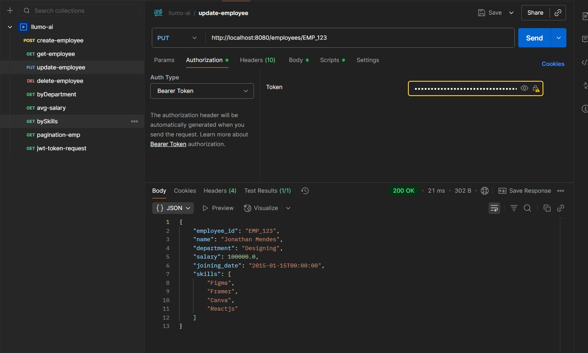
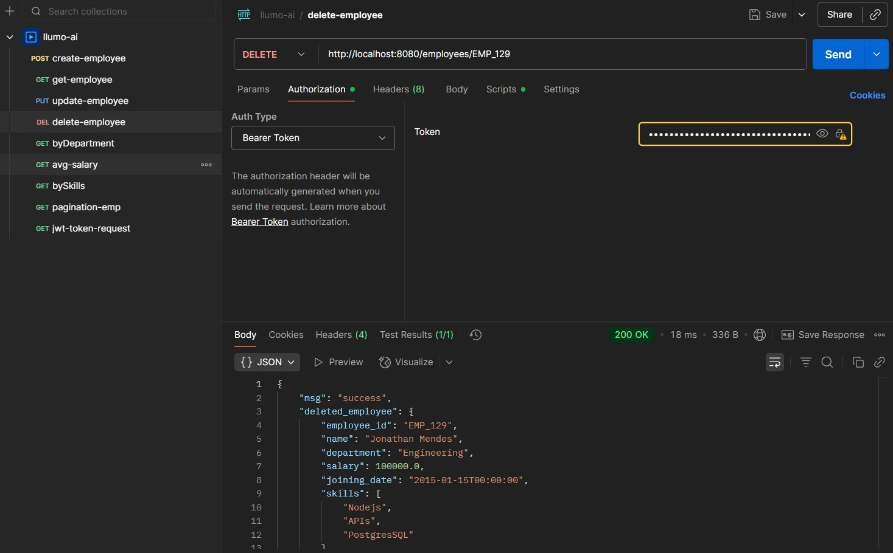

### LUMMO AI Assignment

### Setting up the repo
1. Fork the repo to your GitHub account.
2. Clone the forked repo to your local machine.
3. Navigate to the project directory.

### Installing dependencies
```bash
uv sync
```

### Make sure to have .env as same as .env.example
```bash 
cp .env.example .env
```

#### Set the username and password and also at time of hitting /token endpoint this username and password is verified so use that same while hitting /token from curl/postman/test. 

### Running MongoDB locally
Start the mongoDB server locally before running the application 

### Running the application
```bash
uvicorn src.main:app --port 8080 --reload
```

### You can test the endpoints using curl or Postman (Have sended invite to the email of hr that was on mail)
[Postman Workspace](https://llumoai-assignment.postman.co/workspace/learn~fc1c5322-b2e0-4a40-8de6-bf66270aa779/collection/36779485-4fb642be-d699-4376-bcf5-ff7e0d55e553?action=share&creator=36779485)


### Make sure first hit /token with username and password to get the token and then use that token to hit other endpoints.

Proof of all endpoints working:
#### Create employee 


#### Get employee


#### Update employee 


#### Delete employee


#### Get by department


#### Get avg salary


#### Get by skills


#### Pagination on employees


### Note: Have done all tasks including optional and bonus one.
